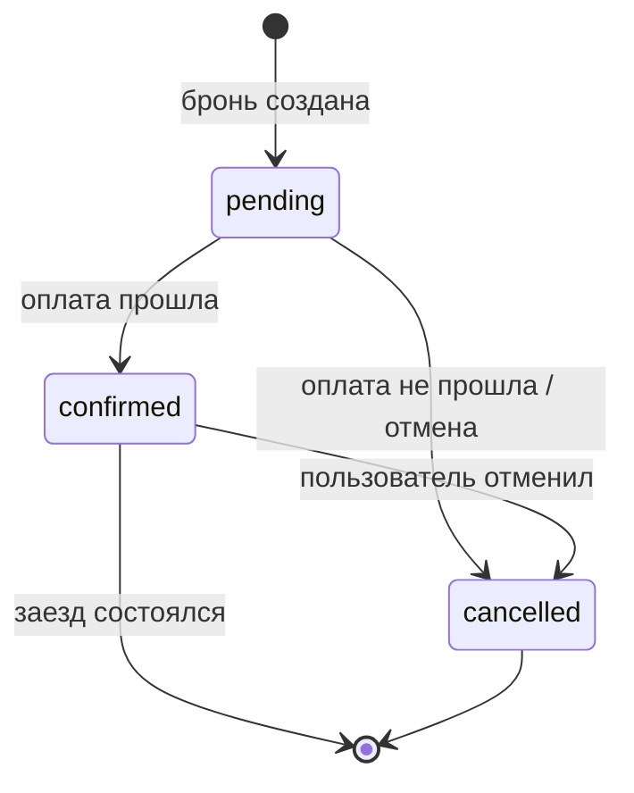

# State Transition — переходы `Booking` под тесты

Статусы: `pending | confirmed | cancelled`.

## Что покрыть тестами и почему

| Переход | Почему |
|---------|--------|
| `-> pending` | Базовый happy path: бронь создаётся, комната резервируется на нужные даты. |
| `pending -> confirmed` | Оплата прошла, бронь действительна, уходит письмо. Проверить идемпотентность (без дублей). |
| `pending -> cancelled` (оплата) | Оплата не прошла: резерв должен освободиться |
| Комната недоступна | Комната недоступна: бронь не создаётся, в базе не остаётся лишней записи pending, ответ 409. |
| `confirmed -> cancelled` | Отмена оплаченной брони: возврат средств + освобождение дат. |

## Что система должна запрещать (тоже проверяем тестами)

- Оплатить или снова активировать уже отменённую бронь.
- Оплатить бронь второй раз: оплата не должна проходить и не должно уходить второе письмо.
- Отменить бронь, которая уже отменена: система не должна падать с ошибкой.
